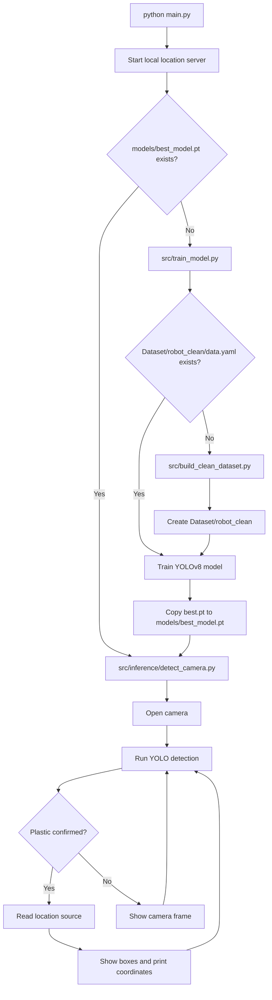

# Plastic Waste Detection System Workflow

This document summarizes the current training, detection, and location flow.

## Overview

The project has three runtime stages:

1. Start the application from `main.py`.
2. Build/train only if `models/best_model.pt` is missing.
3. Run live camera detection with optional latitude/longitude output.

## Data Flow



## Active Files

`main.py`
: Entry point. Starts the local location page, checks for the production model, runs training if needed, then launches detection.

`src/train_model.py`
: Trains YOLOv8 using `Dataset/robot_clean/data.yaml`. Uses CUDA settings when a GPU is available and CPU-friendly settings otherwise. Saves the best model to `models/best_model.pt`.

`src/build_clean_dataset.py`
: Builds `Dataset/robot_clean` from the available image, label, and mask sources. It removes duplicate images by hash, validates YOLO labels, converts masks to boxes, and writes `data.yaml`.

`src/inference/detect_camera.py`
: Opens a camera, runs YOLO inference, requires confirmed detections across multiple frames, overlays boxes, and prints location when plastic is detected.

`src/location_provider.py`
: Reads location from manual environment variables, the local browser location endpoint, Windows Location Services, or optional IP-based location.

`src/phone_location_server.py`
: Serves `http://127.0.0.1:8765/location-page` and stores the latest browser location update for the detector.

`src/evaluate.py`
: Runs validation for `models/best_model.pt` against `Dataset/robot_clean/data.yaml`.

## Generated Outputs

`runs/`
: Ultralytics training and evaluation outputs.

`Dataset/**/labels/*.cache`
: YOLO dataset cache files. These are generated automatically and can be deleted.

`src/**/__pycache__/`
: Python bytecode cache directories. These are generated automatically and can be deleted.

## Main Commands

```powershell
python main.py
python -m src.inference.detect_camera
python -m src.train_model
python -m src.evaluate
```
