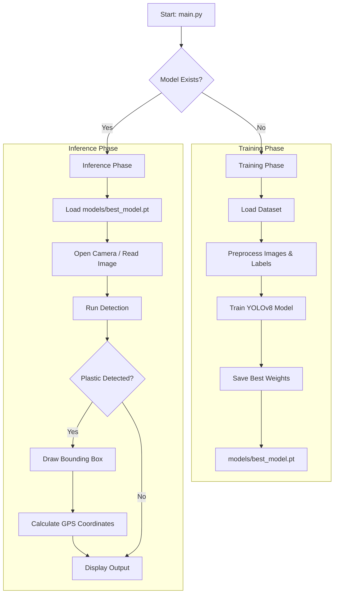

# Plastic Waste Detection System - Workflow & Dataflow

This document outlines the operational flow of the Plastic Waste Detection System, from data input/training to real-time inference.

## 1. System Overview

The system is designed to detect plastic waste in water bodies using computer vision (YOLOv8). It consists of two main phases:
1.  **Training Phase**: Learning to recognize plastic from a labeled dataset.
2.  **Inference Phase**: Detecting plastic in real-time video or static images using the trained model.

## 2. Data Flow Architecture

## 3. Detailed Workflow

### A. Initialization (`main.py`)
-   **Entry Point**: The user runs `python main.py`.
-   **Logic**: The script checks if `models/best_model.pt` exists.
    -   If **MISSING**: It automatically triggers the training process (`training/train.py`).
    -   If **PRESENT**: It proceeds directly to the inference/execution phase.

### B. Training (`training/train.py`)
-   **Input**:
    -   `dataset/images`: Raw images of water bodies.
    -   `dataset/labels`: YOLO-format annotations for "plastic" (class 0).
-   **Process**:
    -   Validates image-label pairs.
    -   Splits data into Training/Validation sets (80/20).
    -   Generates `data.yaml` configuration.
    -   Trains the YOLOv8n model for a specified number of epochs (default: 50).
-   **Output**:
    -   Saves the best-performing model weights to `models/best_model.pt`.
    -   Generates training metrics (Loss, mAP, Precision, Recall) in `runs/`.

### C. Inference (`inference/detect_camera.py`)
-   **Input**:
    -   Live video feed from the system's default camera (Webcam 0).
    -   Trained model: `models/best_model.pt`.
-   **Process**:
    -   Captures frames in real-time.
    -   Runs the model on each frame.
    -   Filters detections based on a confidence threshold (default: >50%).
    -   Calculates "Pseudo-GPS" coordinates based on screen position.
-   **Output**:
    -   **Visual**: Displays the video feed with bounding boxes around detected plastic using OpenCV.
    -   **Terminal**: Prints detection details (Confidence, Bounding Box, GPS) and System FPS.

## 4. File Structure
-   `main.py`: Master script to run the project.
-   `training/train.py`: Script to train the model.
-   `inference/detect_camera.py`: Script for real-time detection.
-   `dataset/`: Directory containing images and labels.
-   `models/`: Directory where the trained model is saved.
