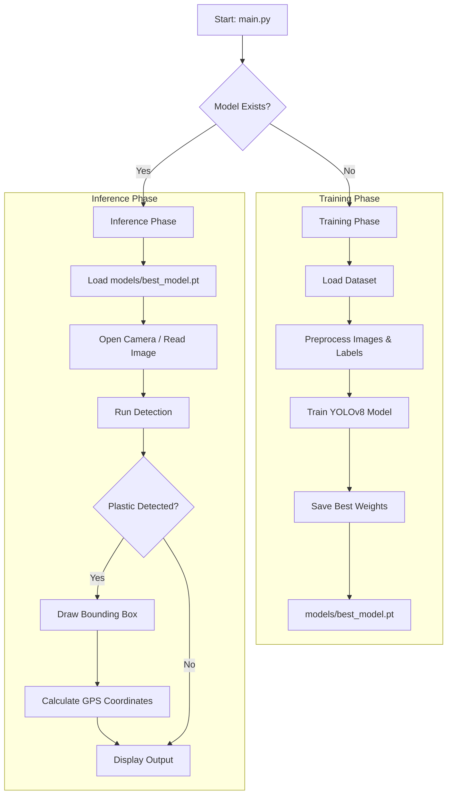

# Plastic Waste Detection System - Workflow & Dataflow

This document outlines the operational flow of the Plastic Waste Detection System, from data input/training to real-time inference.

## 1. System Overview

The system is designed to detect plastic waste in water bodies using computer vision (YOLOv8). It consists of two main phases:
1.  **Training Phase**: Learning to recognize plastic from a labeled dataset.
2.  **Inference Phase**: Detecting plastic in real-time video or static images using the trained model.

## 2. Data Flow Architecture

## 3. Detailed Workflow

### A. Initialization (`main.py`)
-   **Entry Point**: The user runs `python main.py`.
-   **Logic**: The script checks if `models/best_model.pt` exists.
    -   If **MISSING**: It automatically triggers the training process (`training/train.py`).
    -   If **PRESENT**: It proceeds directly to the inference/execution phase.

### B. Training (`training/train.py`)
-   **Input**:
    -   `dataset/images`: Raw images of water bodies.
    -   `dataset/labels`: YOLO-format annotations for "plastic" (class 0).
-   **Process**:
    -   Validates image-label pairs.
    -   Splits data into Training/Validation sets (80/20).
    -   Generates `data.yaml` configuration.
    -   Trains the YOLOv8n model for a specified number of epochs (default: 50).
-   **Output**:
    -   Saves the best-performing model weights to `models/best_model.pt`.
    -   Generates training metrics (Loss, mAP, Precision, Recall) in `runs/`.

### C. Inference (`inference/detect_camera.py`)
-   **Input**:
    -   Live video feed from the system's default camera (Webcam 0).
    -   Trained model: `models/best_model.pt`.
-   **Process**:
    -   Captures frames in real-time.
    -   Runs the model on each frame.
    -   Filters detections based on a confidence threshold (default: >50%).
    -   Calculates "Pseudo-GPS" coordinates based on screen position.
-   **Output**:
    -   **Visual**: Displays the video feed with bounding boxes around detected plastic using OpenCV.
    -   **Terminal**: Prints detection details (Confidence, Bounding Box, GPS) and System FPS.

## 4. Per-File Breakdown & Key Functions

### A. Core Scripts
**1. `main.py`**
- **Role**: Master entry point for the application. Orchestrates the training and inference pipelines.
- **Key Function**: `main()`
  - **Signature**: `def main():`
  - **Input**: None (Uses resolved system paths).
  - **Logic**: Validates the existence of `models/best_model.pt`. If missing, spawns a subprocess to execute `src/train_model.py`. Upon successful training or if the model already exists, it spawns a subprocess to execute `src/inference/detect_camera.py`.
  - **Output**: None (Executes sub-processes and exits with status codes).

**2. `src/train_model.py`** (Training Pipeline)
- **Role**: Manages the YOLOv8 model training process using a pre-configured dataset.
- **Key Function**: `main()`
  - **Signature**: `def main():`
  - **Input**: None (Reads `Dataset/final/data.yaml` and base model `yolov8s.pt`).
  - **Logic**: Initializes the YOLO model. Calls `model.train()` with hyperparameter settings (e.g., epochs=100, imgsz=640, automatic 80/20 train/val split handling). Searches the `runs/` directory for the resulting `best.pt` weights and copies them to the production `models/best_model.pt` path.
  - **Output**: None (Writes `best_model.pt` to disk).

**3. `src/inference/detect_camera.py`**
- **Role**: Executes real-time plastic detection using a camera feed and the trained model.
- **Key Function**: `open_camera()`
  - **Signature**: `def open_camera():`
  - **Input**: None
  - **Logic**: Iterates through multiple OpenCV backends (`CAP_DSHOW`, `CAP_MSMF`, `CAP_ANY`) and indices to securely initialize the camera hardware.
  - **Output**: `cv2.VideoCapture` object on success, `None` on failure.
- **Key Function**: `main()`
  - **Signature**: `def main():`
  - **Input**: None
  - **Logic**: Loads `models/best_model.pt`. Reads frames in a continuous loop, resizes them to `640x640`, and passes them to the YOLO model for inference. Applies a confidence threshold (filtered at e.g., >15% or 50% depending on configuration) and renders bounding boxes using YOLO's `plot()`.
  - **Output**: None (Renders OpenCV GUI window, prints detection details, pseudo-GPS, and FPS to `stdout`).

### B. Helper Modules
**1. `src/prepare_dataset.py`**
- **Role**: Structures raw images and labels into standard YOLO formats and creates train/val/test splits.
- **Key Functions**: Includes `split_dataset(files)` to partition data (e.g., 70/20/10 split) and `copy_files()` to move `.jpg` and `.txt` pairs into their respective directories.

## 5. Configuration & Dependencies

- **`data.yaml`**: The core YOLO configuration file. Defines the dataset paths (`train`, `val`, `test`), the number of classes (`nc`), and class names (e.g., `['plastic']`). Required for `train_model.py` to locate the training data.
- **`requirements.txt`**: Defines required Python dependencies (`ultralytics`, `torch`, `opencv-python`, etc.). Ensures a reproducible environment for training and inference.
- **Dataset Structure (`Dataset/final/`)**:
  - `images/`: Contains `train/`, `val/`, and `test/` subdirectories with raw `.jpg`/`.png` images.
  - `labels/`: Contains `train/`, `val/`, and `test/` subdirectories with YOLO-format `.txt` files containing normalized bounding box coordinates.

## 6. Data Types & Structures

- **Detection Output Object**: An ultralytics `Results` object. Contains the `.boxes` attribute holding all detected bounding boxes for a single frame.
- **Confidence Score**: A floating-point value (`float`) between `0.0` and `1.0` representing the model's certainty that the detected object is plastic.
- **Bounding Box Format**: Standard YOLO output utilized is the `xyxy` coordinate format (xmin, ymin, xmax, ymax) in absolute pixel values, which is used natively by OpenCV for rendering rectangles.
- **GPS Tuple**: Represented as a `(latitude, longitude)` float tuple. Calculated contextually or mocked during testing, ready to be integrated with actual GPS sensor data in hardware deployment.

## 7. Model Directories

- **`models/`**: The production directory. Stores the finalized `best_model.pt` weights required by `main.py` to initiate real-time inference.
- **`runs/`**: The Ultralytics YOLO default logging directory. Automatically stores training iterations, evaluation metrics (loss graphs, precision/recall curves, mAP@0.5), and intermediate model weights.
